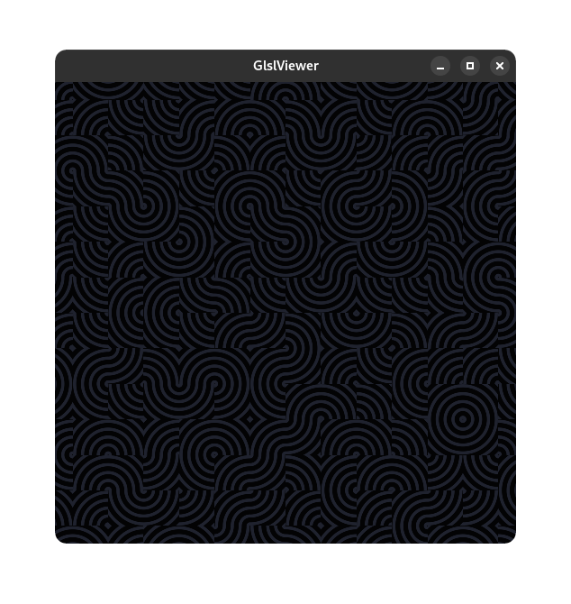

# Shader
A simple (looking) shader that i made. The code is pretty messy and uncommented, I may or may not return to it.

# Image
This is what it looks like in general

# References
I used this repo, [webgl-noise](https://github.com/ashima/webgl-noise) for the randomness.
# License
MIT
